<p align="center">

</p>

<h1 align="center">Lumina</h1>

<p align="center">
A Client-Server E-Book Management System
</p>

<p align="center">
A local digital library platform running on localhost / local network for users, publishers, and administrators
</p>

<p align="center">


</p>

## 📚 Table of Contents
* 📖 [About The Project](#-about-the-project)
* 🎯 [Main Goals](#-main-goals)
* ✨ [Features](#-features)
  * 🔐 [Authentication & Account Management](#-authentication--account-management)
  * 👤 [Regular User Panel](#-regular-user-panel)
  * 📚 [Publisher Panel](#-publisher-panel)
  * 🛡️ [Admin Panel](#%EF%B8%8F-admin-panel)
  * 🔔 [Notification System](#-notification-system)
  * 🌐 [Network Error Handling & Connection Management](#-network-error-handling--connection-management)
  * 🖥️ [Server Management Panel](#%EF%B8%8F-server-management-panel)
* 📐 [Initial UML Design](#-initial-uml-design)
* 🏗️ [System Architecture](#%EF%B8%8F-system-architecture)
* 📂 [Project Structure](#-project-structure)
* 🛠️ [Technologies](#%EF%B8%8F-technologies)
* 🖥️ [Screenshots](#%EF%B8%8F-screenshots)
* 🚀 [Build & Run](#-build--run)
* 📦 [Deployment](#-deployment)
* 👥 [Team](#-team)

---

## 📖 About The Project

### Lumina 📖✨ Your Smart Digital Library

Lumina is a local Client-Server E-Book Management System developed using C++ and Qt.
The project provides a complete digital bookstore and library experience running locally over localhost/LAN, where users can explore books, purchase digital content, manage their personal library, and interact with publishers.

The system supports three main roles:
* 👤 **Regular Users**
* 📚 **Publishers**
* 🛡️ **Administrators**

Each role has its own dedicated panel with different capabilities and responsibilities.

Lumina uses a Client-Server architecture where the client communicates with the server over local network connections (localhost) through TCP socket programming using a JSON-based communication protocol.
The server is responsible for processing requests, managing application logic, handling multiple clients, and interacting with the SQLite database.

> **Note:** The purchasing system in Lumina is a simulation of an online bookstore workflow and does not include real payment processing.

---

## 🎯 Main Goals

The main goals of Lumina are:
* Creating a structured Client-Server application
* Applying Object-Oriented Programming (OOP) concepts
* Designing a multi-user system with different roles
* Implementing network communication using TCP sockets
* Managing persistent data using SQLite
* Providing a modern graphical user interface (GUI)
* Implementing real-time notification communication between server and clients

---

## ✨ Features

### 🔐 Authentication & Account Management
Lumina provides a role-based authentication system for different types of users.

#### 📝 Registration
Users can create an account by providing:
* 👤 Unique username
* 🔑 Password
* ❓ Security question and answer
* 🎭 Account role selection:
  * Regular User
  * Publisher

The selected role cannot be changed after registration. An administrator account is also available with predefined credentials.

#### 🔑 Login System
* User authentication using username and password
* Role-based access to different application panels
* Separate interfaces for Regular Users, Publishers, and Administrators

#### 🔄 Password Recovery
Users who forget their password can recover their account by:
* Entering their username
* Receiving their registered security question
* Providing the correct answer
* Setting and confirming a new password

### 👤 Regular User Panel

#### 🎯 Personalized Experience
When a user logs in for the first time, they can select 1 to 3 favorite genres. These preferences are used to provide personalized book recommendations. Users can later modify their favorite genres from their profile.

#### 🏠 Home Page
Provides different categories of books, including:
* 🎯 Recommended books based on user preferences
* 🔥 Best-selling books
* ⭐ Popular books
* 🆕 New releases
* 🆓 Free books

#### 📚 Book Details & Reviews
Users can:
* View complete book information
* Read other users' comments
* Rate books and submit personal reviews
* Edit or delete their own reviews

#### 🛒 Shopping Cart & Purchase Management
Allows users to:
* Add/Remove books to/from cart
* View purchase summary and complete simulated purchases

Dynamic actions based on status:
* **Add to Cart** → for unpurchased books
* **Remove from Cart** → if the book already exists in the cart
* **Read Book** → for purchased books

#### 🧾 Purchase History
View previous purchases including book title, price, purchase date, and time.

#### 👤 User Profile Management
Manage personal details (username, password, first/last name, email, and favorite genres).

#### 🔎 Advanced Book Search
Search books by Title, Author, Publisher, or Genre with flexible combinable filters.

#### 📚 Personal Library
* 🛍️ **Purchased Books:** View purchased books and open them directly using the built-in PDF Reader.
* 🔖 **Bookmarks:** Bookmark favorite books with visual indicators on book covers.
* 📂 **Personal Shelves:** Create, rename, delete, and organize shelves using drag-and-drop interaction.

#### 📄 Built-in PDF Reader
* Open purchased books directly inside the application
* Automatically save the user's last reading position and resume reading upon reopening

### 📚 Publisher Panel

#### 📊 Publisher Dashboard
Overview of publishing activity including total books published, total sales amount, best/lowest-selling books, and individual sales statistics.

#### 📖 Book Management
* Add new books, edit book information, and permanently delete books
* Disable or enable books
* Apply discounts
* Read published books using the built-in PDF Reader and monitor reviews/ratings

#### 📤 Publishing New Books
Publish books by providing title, author name, genre, description, cover image, and PDF file.

#### 👤 Publisher Profile
Manage credentials, personal details, and publishing house name.

### 🛡️ Admin Panel

#### 👥 User Management
* View user details (ID, Username, Role, Registration Date, Account Status)
* Permanently delete users or temporarily block/unblock accounts
* Inspect detailed activity (Purchased books for users / Published books for publishers)

#### 🔎 Advanced User Search & Filtering
Filter users based on keywords, registration month/year/date, role, and account status.

#### 📚 Book Management
View all books, edit information, delete books, read books via PDF Reader, and remove inappropriate reviews.

### 🔔 Notification System
Lumina includes a real-time notification system featuring:
* 🔔 Notification bell in the application header with an unread counter
* 🔊 Sound alerts and animated pop-ups
* 📋 Notification center with read/unread status management

**Notification Types:**
* 👤 **Regular Users:** Discounts on bookmarked books & new releases from favorite genres.
* 📚 **Publishers:** New ratings, new reviews, and new book purchases.

### 🌐 Network Error Handling & Connection Management
If the client loses connection with the server (e.g., localhost or LAN network interruption):
* 🔌 Disconnected state is detected automatically
* 🖥️ Dedicated QML-based disconnection page is displayed
* 🔒 Application controls are disabled to prevent invalid requests
* 🔄 Users can retry the connection using the retry button without restarting the app

### 🖥️ Server Management Panel
A graphical panel for monitoring and controlling server-side operations:
* 🌐 Real-time handling of client-server TCP communication over local host/network
* 🗄️ SQLite database operations & notification dispatching
* 💻 Live CPU and RAM resource usage monitoring
* 📜 Real-time server activity logs

---

## 📐 Initial UML Design

Before implementation, an initial UML design was created to visualize system entities, relationships, and workflows.

<p align="center">
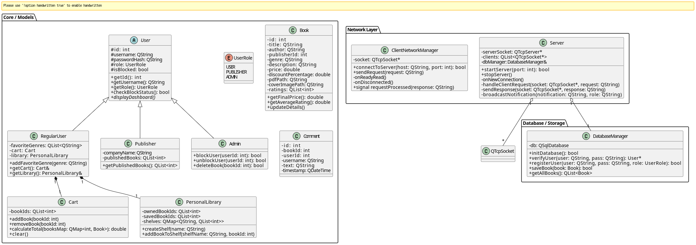
</p>

---

## 🏗️ System Architecture

Lumina follows a Client-Server architecture divided into distinct layers:

```text
+-------------------------------------------------+
|               Client Application                |
|        (Qt Widgets / QML / PDF Reader)          |
+-------------------------------------------------+
                        |
            TCP Sockets | JSON Protocol
                        v
+-------------------------------------------------+
|               Server Application                |
|       (Multithreaded / Business Logic)          |
+-------------------------------------------------+
                        |
                        v
+-------------------------------------------------+
|                 SQLite Database                 |
+-------------------------------------------------+
```

* 💻 **Client Application:** Qt 6 (C++ & QML) UI for Users, Publishers, and Admins. Handles views, notifications, and connection states.
* 🖥️ **Server Application:** Multithreaded C++ application running locally, handling concurrent client TCP sockets, authentication, JSON request/response processing, and live logging.
* 🗄️ **Database Layer:** SQLite storing accounts, books, reviews, carts, purchases, bookmarks, shelves, and notifications.

---

## 📂 Project Structure

The project is organized into separate client, server, and shared components:

```text
Lumina
│
├── Client/                    → Qt desktop application (User, Publisher, and Admin interfaces)
│
├── Server/                    → Multithreaded server, business logic, database management, and request handling
│
├── Shared/                    → Common data models and base classes shared between Client and Server
│                                (e.g., User, Book, and other core entities)
│
├── API_CONTRACT.md            → Client-Server communication protocol and JSON request/response definitions
│
├── installer/                 → Deployment and packaging scripts
│
└── assets/                    → Project resources, logo, screenshots, and documentation images
```
---

## 🛠️ Technologies

<p align="center">


</p>

---
## 🖥️ Screenshots

| Login & Authentication | First-Time Genre Selection |
| :---: | :---: |
| 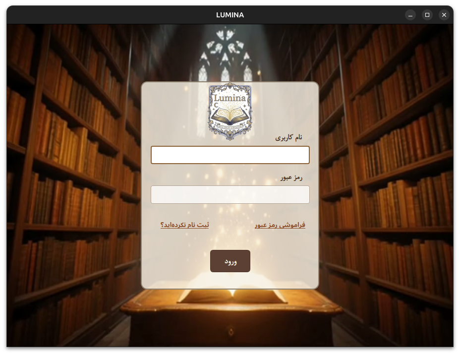 | 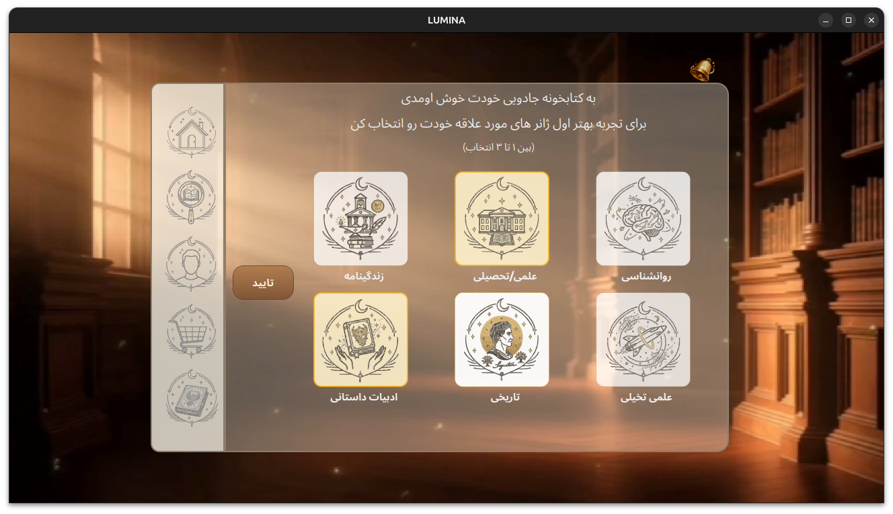 |

| User Home Page | Advanced Search & Genres |
| :---: | :---: |
| 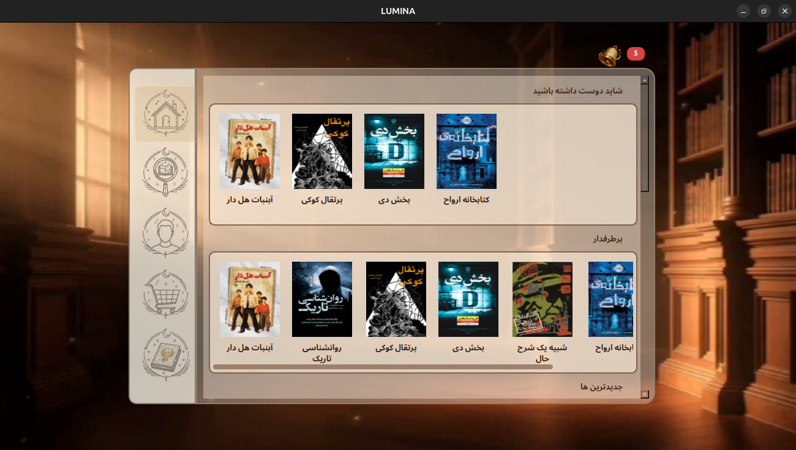 | 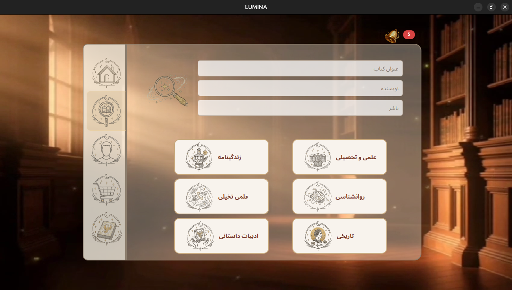 |

| Book Details | User Reviews & Rating |
| :---: | :---: |
| 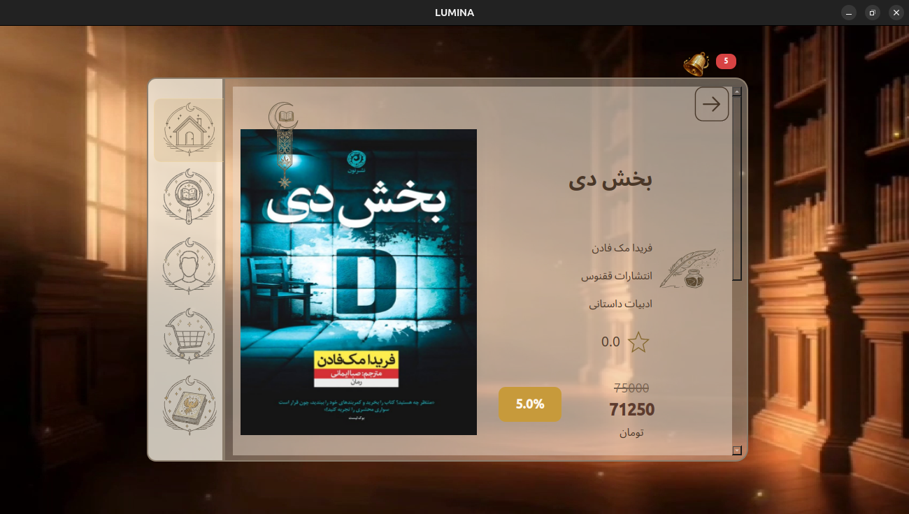 | 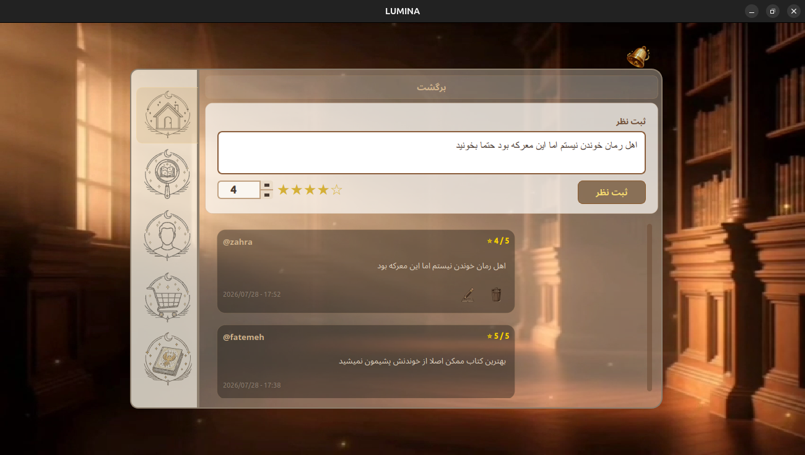 |

| Built-in PDF Reader | Personal Library & Shelves |
| :---: | :---: |
| 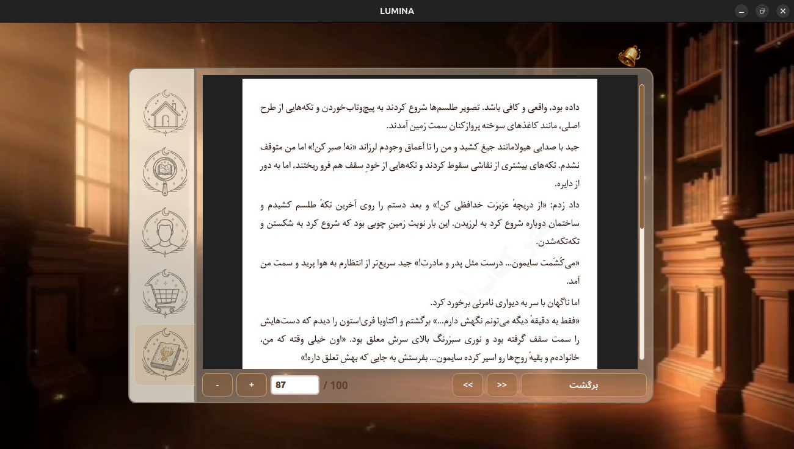 | 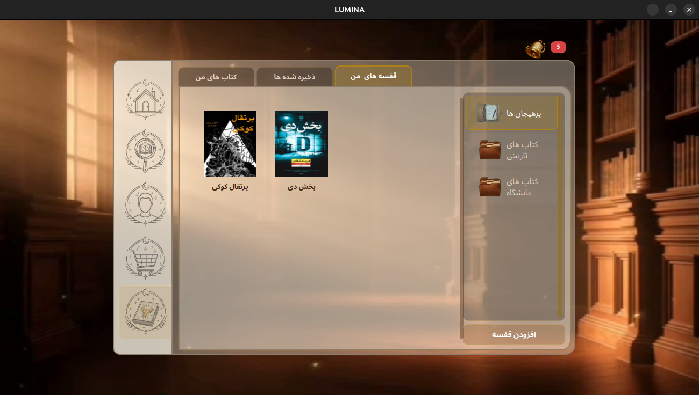 |

| Shopping Cart | Publisher Dashboard |
| :---: | :---: |
| 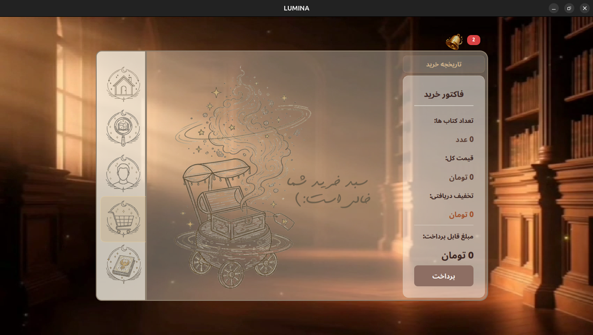 | 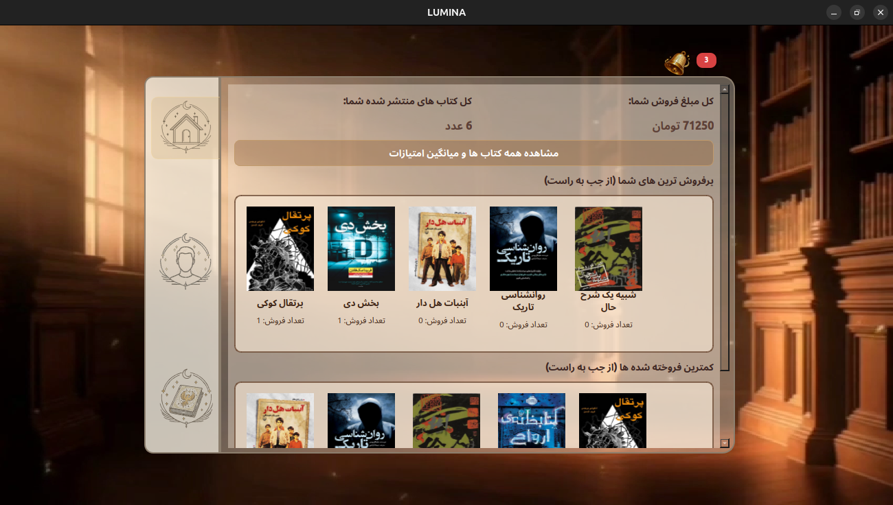 |

| Admin User Management | Network Reconnection Screen |
| :---: | :---: |
| 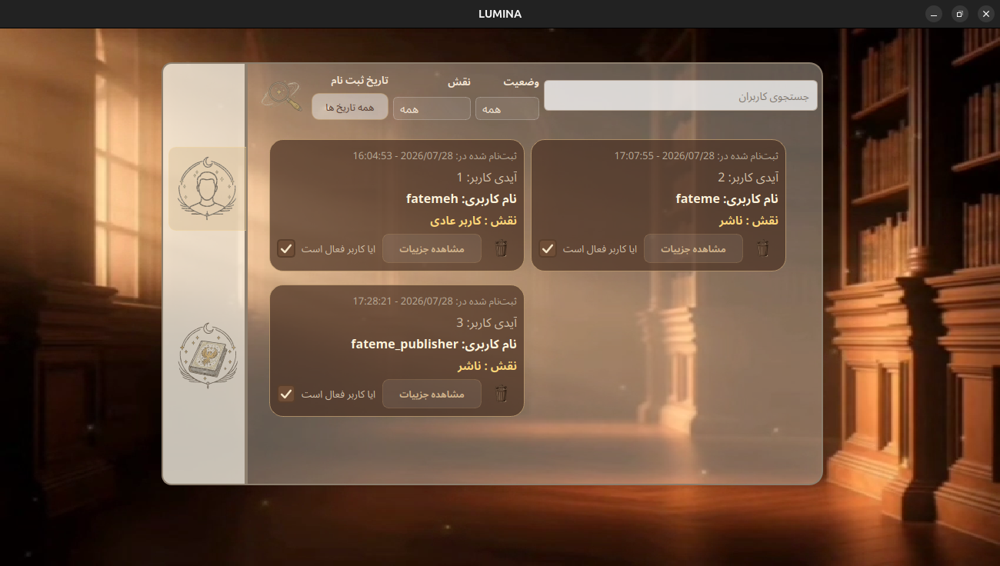 |  |

| **Real-time Notifications (Alert & Bell)** | Notification Center |
| :---: | :---: |
| **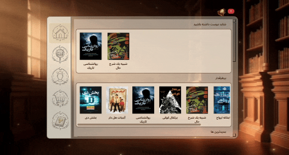** | 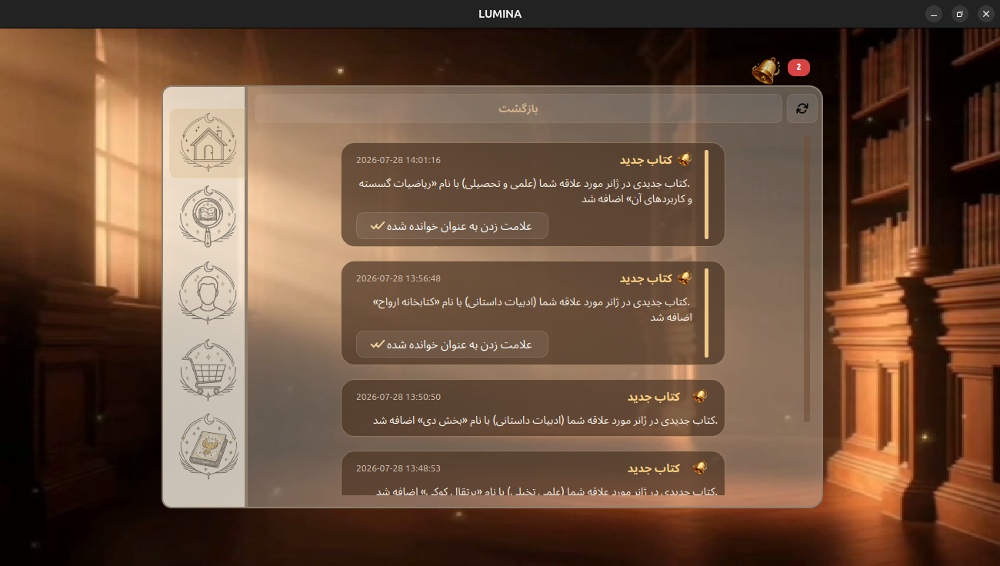 |

<p align="center">
  <b>Server Management Dashboard (Live Resource & Network Monitoring)</b><br>
  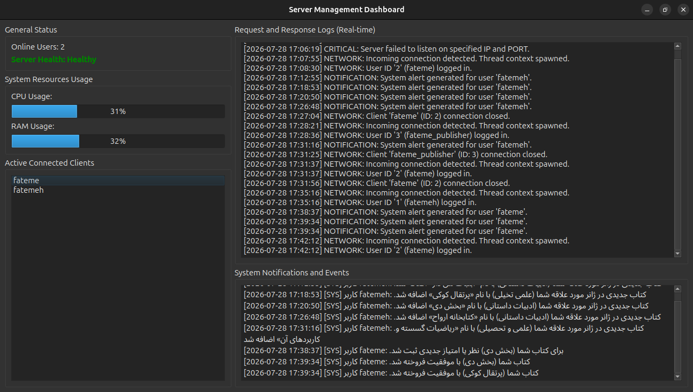
</p>

---

## 💡 Tips

> [!TIP]
> To edit or delete a personal shelf, right-click on the shelf item and use the context menu.

> [!TIP]
> Publishers can view book reviews and ratings by clicking the ⭐ star icon associated with each book.

> [!TIP]
> After bookmarking a book from its details page, a bookmark icon will appear on the book cover. Click the icon again to remove the bookmark.
---

## 🚀 Build & Run

### Prerequisites
* C++17 compatible compiler (GCC, Clang, or MSVC)
* CMake 3.16 or higher
* Qt 6.4.2+ with required modules: `Core`, `Widgets`, `Network`, `Sql`, `Multimedia`, `MultimediaWidgets`, `Pdf`, `PdfWidgets`, `Quick`, `QuickWidgets`

### 🛠️ Building from Source

1. **Clone the Repository**
```bash
git clone https://github.com/Onyx1907/Lumina-EBook-Platform.git
cd Lumina-EBook-Platform
```

2. **Build Client & Server**
Build the full project using CMake from the root directory:
```bash
mkdir build && cd build
cmake -DCMAKE_BUILD_TYPE=Release ..
make -j$(nproc)
```

The compiled binaries will be generated inside their respective output folders:
* Client Executable: `./Client/LuminaClient`
* Server Executable: `./Server/LuminaServer`

### 📦 Building AppImage (Linux Portable Package)
To package the client into a Linux AppImage:
```bash
chmod +x installer/build_appimage.sh
./installer/build_appimage.sh
```
The output package will be placed inside `installer/packaging_dir/`.

---

## 📦 Deployment

Pre-built binaries and ready-to-use installers are available in the project's **Releases** section:
* 🪟 **Windows:** Installer package created using Inno Setup (`.exe`)

---

## 👥 Team

* 👩‍💻 [Onyx1907](https://github.com/Onyx1907) — *Client Application Developer*
  * Client-side architecture & application development
  * Qt Widgets / QML user interface
  * Client networking & feature implementation

* 👩‍💻 [SanaAliAkbari](https://github.com/SanaAliAkbari) — *Server Application Developer*
  * Server-side architecture & application development
  * Database design & SQLite integration
  * Request processing & server management

---

<p align="center">
Made with ❤️ using C++ and Qt
</p>
